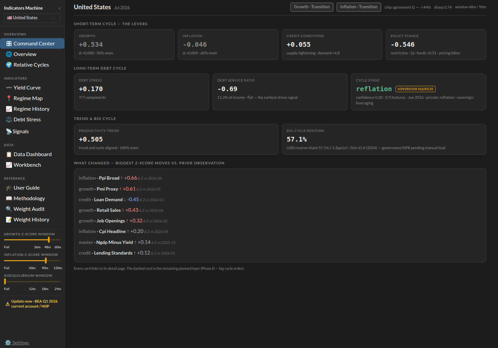
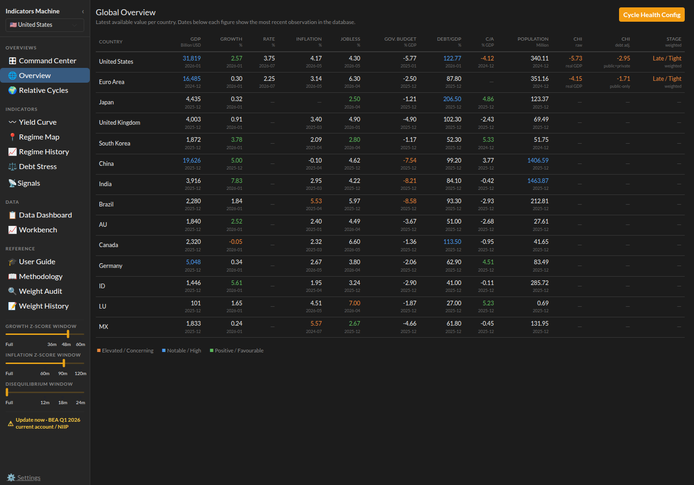
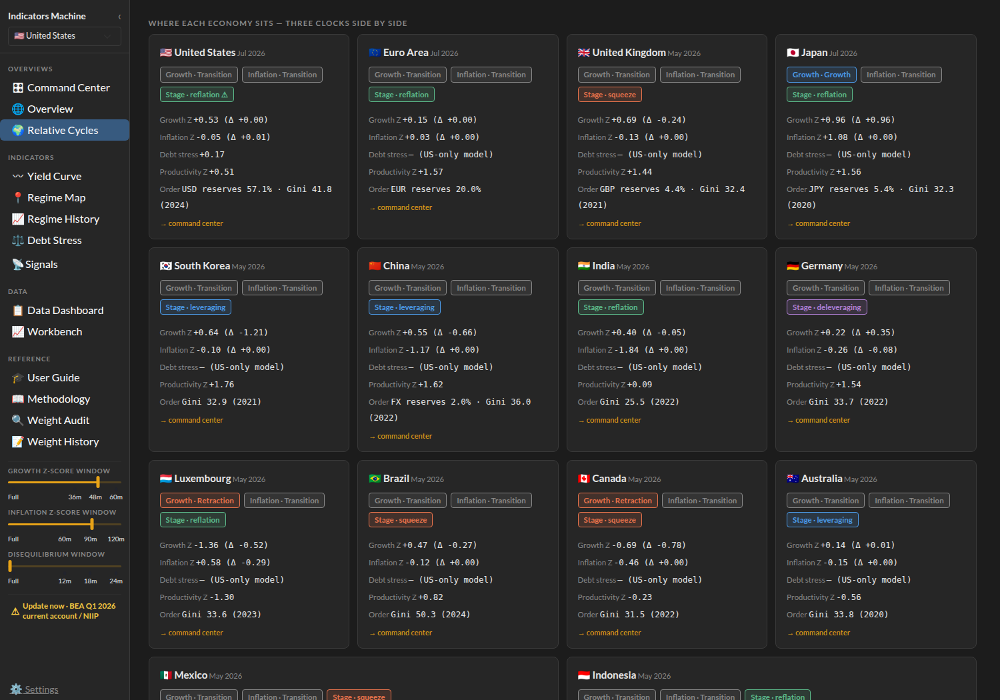
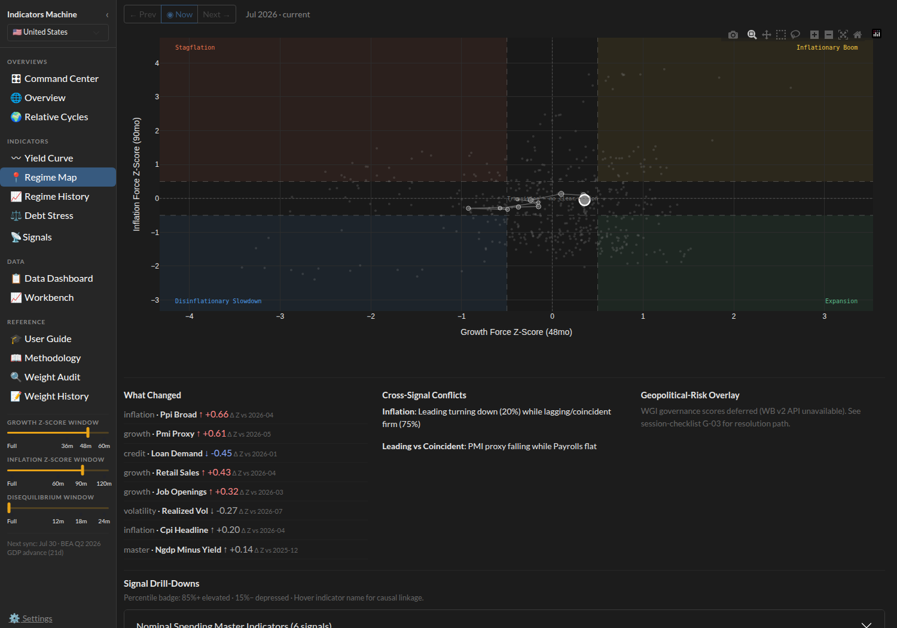
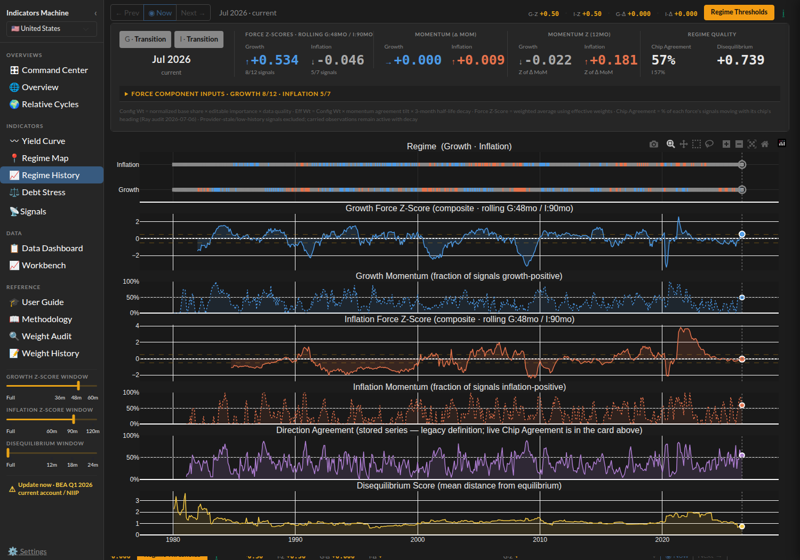
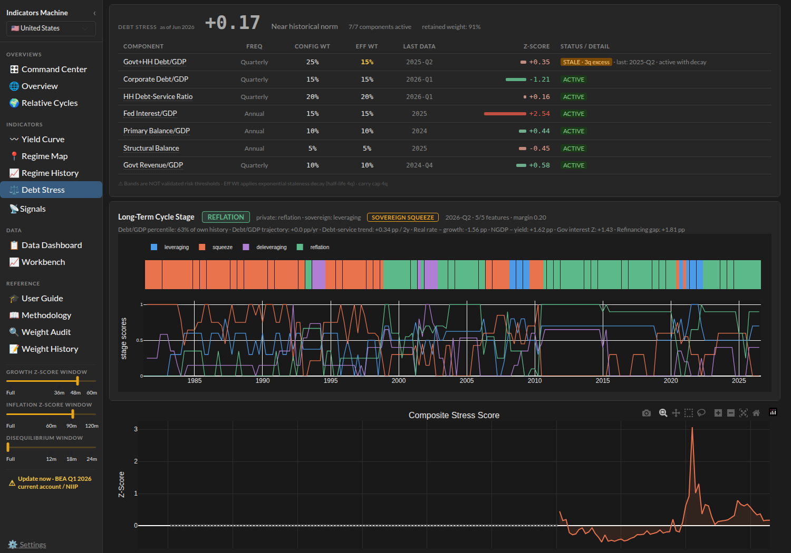
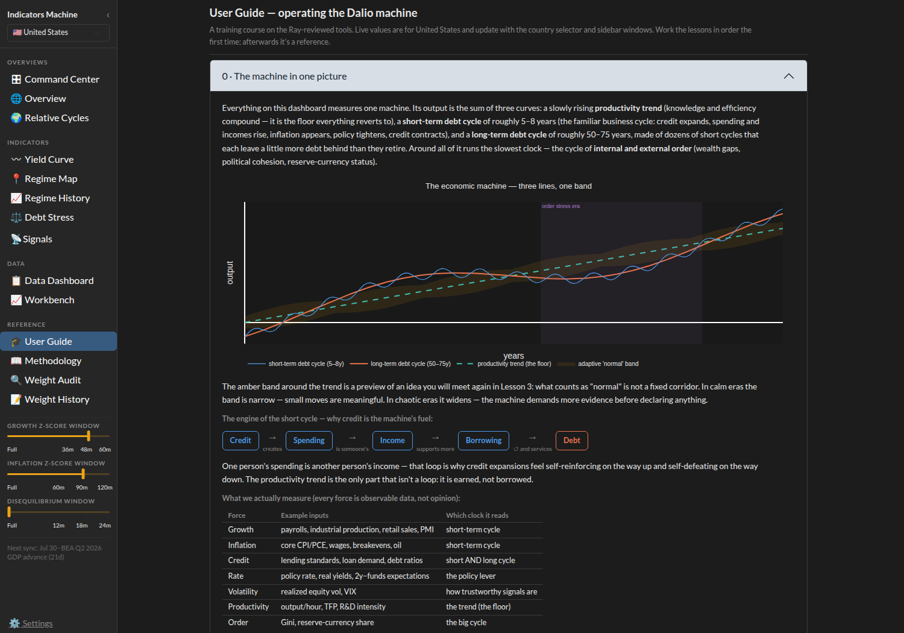
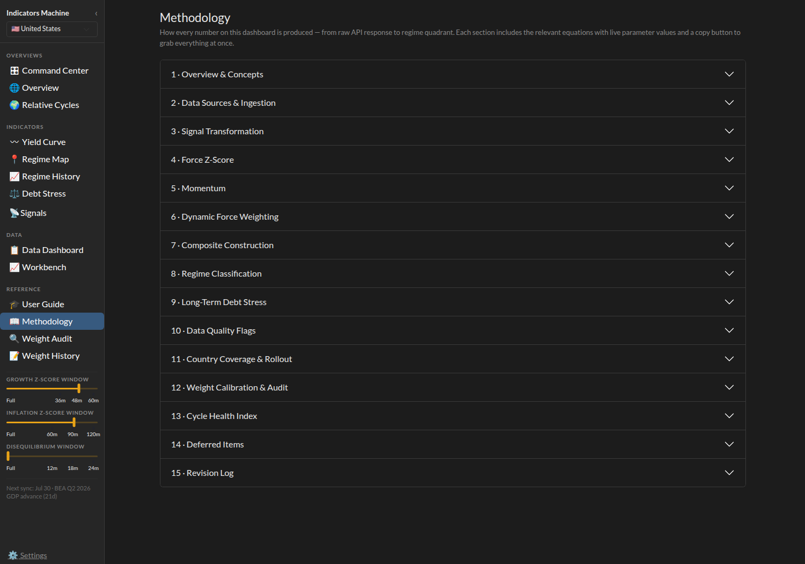

# The Economic Machine Dashboard

**A tool for reading the world's economies the way Ray Dalio reads them — no finance degree required.**

Ray Dalio's core idea is that an economy isn't a mystery; it's a **machine** that runs on a few simple, repeating cause‑and‑effect rules. Once you can see the machine, the headlines stop being noise and start being a story you can follow. This project takes that idea and turns it into a live dashboard: it pulls real economic data for **14 major economies**, from free public sources, and reads each one on the three "clocks" Dalio uses to understand any country.

> **What it is:** a *diagnostic* — a way to **understand** where economies are in their cycles.
> **What it is not:** financial advice, a stock picker, or a trade recommender. It tells you *where we are*, not *what to buy*.

---

## The three clocks (this is the Dalio part)

Dalio teaches that to understand any economy you have to look at three cycles at once, running at different speeds. This dashboard is built entirely around them:

| Clock | Dalio's idea | What it answers |
| :--- | :--- | :--- |
| ⏱️ **The short‑term cycle** (the two dials) | The 5–8 year boom/bust the central bank steers with interest rates | *Is growth speeding up or slowing? Is inflation rising or falling — right now?* |
| 🌊 **The long‑term debt cycle** (the big wave) | The 50–75 year build‑up and unwind of debt — the subject of Dalio's *Big Debt Crises* | *Is this country still piling on debt, getting squeezed by it, painfully unwinding it, or gently growing out of it?* |
| 🏛️ **The big cycle / changing world order** | The rise and decline of powers, wealth gaps, and reserve currencies — his *Changing World Order* | *Where does this country sit in the bigger arc of history — its inequality, its currency's global standing?* |

A fourth, slow force — **productivity** — sits underneath all three, because it's the only thing that truly raises living standards over time.

Every read in the dashboard maps back to one of these. The framework was also sanity‑checked, concept by concept, against an AI trained on Dalio's writing ("Digital Ray"). *(That's an AI approximation of his framework, not an endorsement from Ray Dalio himself.)*

---

## The pages worth knowing

### 🎛️ Command Center — one country, all three clocks

The front door. Pick a country and this single screen reads it top to bottom the Dalio way: the **short‑term levers** (growth, inflation, credit conditions, the central bank's stance), the **long‑term debt cycle** (how much stress the debt is under, and which stage — here the U.S. reads "reflation," with an amber **SOVEREIGN SQUEEZE** early‑warning flag noting the government's rising interest burden), the **trend & big‑cycle** reads, and a "what changed" feed of the biggest recent moves.



*How to read it: each card is one part of the machine. The top row is the fast‑moving short‑term cycle; the middle row is the slow debt wave; the bottom is the productivity trend and big‑cycle position. Every card clicks through to its own detail page.*

---

### 🌐 Global Overview — every economy on one screen

The at‑a‑glance table: growth, inflation, interest rates, debt‑to‑GDP, the government's budget, and the long‑term cycle **stage** for all 14 economies at once. Colours flag what's notable (red = concerning, green = favourable), and the small date under each number tells you exactly how fresh it is.



*How to read it: scan down a column to compare countries, or across a row to size up one country. The "STAGE" column on the right is the long‑term debt‑cycle read — e.g. "Late / Tight" means a country deep into its debt build‑up.*

---

### 🌍 Relative Cycles — where each economy sits, side by side

The diversification page, and arguably the most Dalio‑ish view. Each country gets a card showing **all three clocks at once**: the two short‑term dials (Growth / Inflation chips), the long‑term debt‑cycle **Stage**, and the big‑cycle **Order** reads (reserve‑currency share, wealth gap). The point Dalio hammers on — *own things at different points in their cycles* — becomes obvious when you can see who's in "squeeze" while others are in "reflation."



*How to read it: green/blue chips = growth or inflation heating up, red = cooling. The Stage chip (e.g. "squeeze," "reflation," "leveraging") is the long‑term clock. Countries with different‑coloured chips are at different points in the cycle — that's where diversification lives.*

---

### 📍 Regime Map — the four economic "seasons"

Dalio's short‑term cycle produces four classic environments, and this plots them as **map geography**. Growth runs left‑to‑right, inflation runs bottom‑to‑top, so the four corners become the four seasons: **Expansion**, **Inflationary Boom**, **Stagflation**, and **Disinflationary Slowdown**. The moving dot is *today*; the trail behind it is where the economy has been.



*How to read it: watch the **shape of the trail**, not just the dot. A trail marching east = growth recovering; a trail curling down from the top‑right = an inflationary boom cooling off. The middle cross is the "Transition" zone — no clear season yet.*

---

### 📈 Regime History — the two dials across 45 years

The long view. This is the short‑term cycle — growth (blue) and inflation (orange) — traced all the way back to 1980, alongside how much the underlying signals agree and how far the economy sits from "normal." It's how you see the rhythm: the recessions, the inflation of the early '80s, 2008, COVID, the 2021–22 surge.



*How to read it: the two big line charts are the growth and inflation "dials" over time — above the dashed line is hot, below is cold. The strips up top show which "season" each month fell in. The panel headers give today's live readings.*

---

### ⚖️ Debt Stress — the long‑term debt cycle up close

This is where Dalio's *Big Debt Crises* work lives. The top table breaks down how much pressure a country's debt is under, component by component (government + household debt, the debt‑service burden, the interest bill, the budget). Below it, the **stage timeline** colours all of history by where the country was in its long‑term debt cycle — **leveraging** (piling on debt), **squeeze** (getting crushed by it), **deleveraging** (the painful unwind), or **reflation** (Dalio's "beautiful deleveraging," gently growing out of it). Crucially, it splits the read into **private‑sector vs. government**, so a country can look calm on the surface while pressure builds underneath — exactly the case flagged here by the **SOVEREIGN SQUEEZE** warning.



*How to read it: the coloured bar is 45 years of the debt clock — watch the long stretches of one colour and the turns between them. The number up top is today's overall debt‑stress reading; "near historical norm" means it's around its own long‑run average.*

---

## What's under the hood (in plain terms)

- **14 economies:** United States, Euro Area, Germany, United Kingdom, Japan, South Korea, China, India, Brazil, Canada, Australia, Mexico, Indonesia, Luxembourg.
- **All data is free and public** — from the U.S. Federal Reserve (FRED), the World Bank, the IMF, and the Bank for International Settlements. No paid data, no black boxes.
- **Every reading is dated** so you always know how current it is, and lower‑quality or "stand‑in" numbers are flagged honestly rather than hidden.
- **More to explore:** a per‑signal **Signals** breakdown, a **Yield Curve** view, a free‑form charting **Workbench**, and a plain‑language **User Guide** — all reachable from the left‑hand menu.

---

## Want to learn how to read it?

Two built‑in pages take you from "what am I looking at?" to genuine understanding — one for beginners, one for the curious.

### 🎓 User Guide — a hands‑on course, taught on live data

A beginner course that teaches the Dalio framework *using the dashboard's own live numbers*. It opens with "the economy is one machine" (the three cycles + the productivity trend, shown as a single picture), then walks lesson by lesson through the two dials, the levers, the debt cycle, and the big cycle. **Every lesson updates with the country you've selected** — so you're never learning on toy examples, you're reading real, current data as you go.



*Work the lessons in order the first time; afterwards it's a quick reference. No finance background assumed — every term is introduced in plain words before it's used.*

### 📖 Methodology — exactly how every number is built

For anyone who wants to trust the numbers: a transparent, section‑by‑section reference covering **how each figure is produced, from the raw data all the way to the regime read** — data sources, transformations, the scoring math, the regime and debt‑cycle rules, data‑quality flags, country coverage, and a full revision log. Nothing is a black box.



*Each section expands to the relevant formulas with live parameter values and a one‑click copy button — so you can check any claim the dashboard makes.*

### 🏫 The Academy *(in progress)*

A fuller, standalone beginner course that expands the User Guide into a structured curriculum — from zero finance to confidently reading any country on all three clocks. See [`academy/CURRICULUM.md`](academy/CURRICULUM.md).

---

## Seeing it live / running it yourself

The dashboard runs as a small web app. If you have Docker installed, from the project folder:

```bash
docker compose up -d          # starts the dashboard
# then open http://localhost:8502 in your browser
```

*(The pages shown above are `/overview`, `/relative`, `/regime-map`, and `/regime-history`.)*

For a **shared/public deployment**, set `PUBLIC_MODE=1` — this hides the operator‑only controls (the auto‑import scheduler, weight calibration, and saving chart views) so many people can browse at once without stepping on each other. Everyone still gets their own theme, country, and view settings (those are per‑browser). You can also watch usage: set `TRAFFIC_KEY` and open `/traffic?key=…` for a simple page-views / visitors dashboard (no third-party tracker).

If you don't run software like this yourself, that's fine — this README's screenshots show the parts of the dashboard most people care about, and your instructor can walk you through the live version.

---

## Honest caveats (Dalio would insist on these)

- **This is a diagnostic, not advice.** It helps you *understand* the machine. It does not tell you what to invest in. For that, you'd need a separate allocation process — which is deliberately out of scope here.
- **Free public data has limits.** Some countries have thinner data than others; where a signal is a stand‑in (a "proxy"), the dashboard says so. Numbers are the latest published figures, not always the freshest.
- **The Dalio framing is our interpretation** of his publicly taught frameworks (the Economic Machine, the debt‑cycle work, the changing‑world‑order work). It is not affiliated with or endorsed by Ray Dalio or Bridgewater.

---

*Built in the spirit of "understand the machine, and the world makes more sense."*
